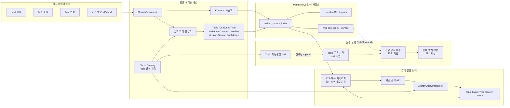
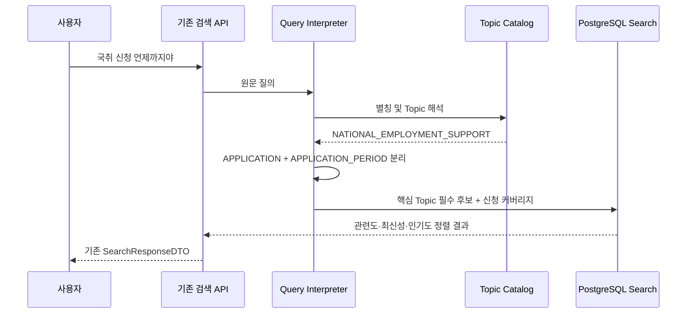
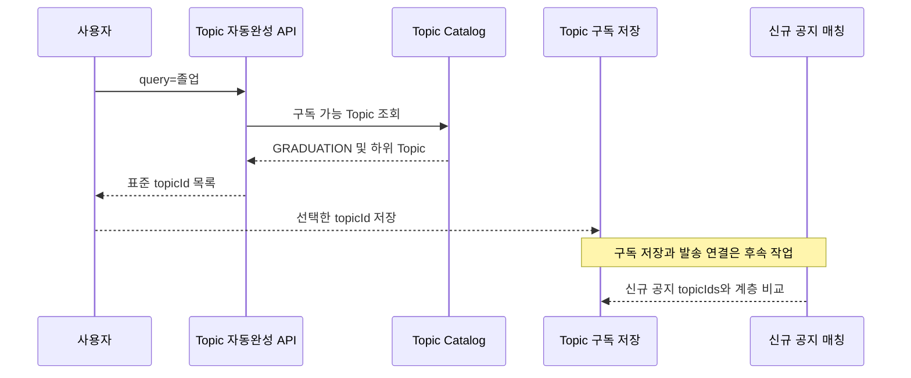

# 대학 공지 통합검색 의미 계층 및 알림 확장 기반 구축

## 1. 프로젝트를 포트폴리오에서 나누는 방법

이 작업은 단순한 검색 가중치 조정이 아니라 다음 다섯 개의 작업 묶음으로 설명한다.

1. 검색 품질 및 데이터 커버리지 진단
2. 공통 공지 의미 계층 설계
3. 핵심 Topic 중심 검색 파이프라인 개선
4. Topic 기반 알림 확장 기반 구축
5. 회귀 테스트와 무중단 호환성 확보

## 2. 전체 아키텍처



검색과 알림은 API나 실행 정책을 합치지 않는다. 두 기능은 Topic Catalog와 공지 분류 결과만 공유한다.

## 3. 기존 문제

### 지나치게 넓은 검색 후보군

기존 검색은 Komoran으로 분리한 여러 단어를 OR로 연결했다. `국장 신청 언제까지야`에서 핵심 개념보다
`신청` 같은 일반어가 많은 문서를 후보로 만들었다. 실제 데이터 조사 당시 관련 국가장학금 공지가 40위,
`축제 일정` 관련 공지가 134위까지 밀리는 사례를 확인했다.

### 약어와 특수문자 표현 불일치

`국취`, `대플`, `재맞고`, `휴·복학`, `신(편)입` 같은 교내 표현은 원문 표기와 검색어 표기가 다르면
동일한 의미로 인식되지 않았다. 검색과 알림이 각자 별칭을 관리하면 장기적으로 결과가 달라질 위험도 있었다.

### 검색 요약과 후보 검색의 강한 결합

기존 `highlightedContent`는 독립적인 의미 요약이 아니라 검색 tsquery로 만든 `ts_headline` 발췌문이다.
후보 문서가 잘못 선택되면 검색 요약도 함께 부정확해지는 구조였다.

### 데이터 품질과 재처리 경로 부족

- 조사 시점의 통합 인덱스: 4,296건, 활성 4,288건
- 원본 `department_notice` 388건이 통합 검색 동기화 대상에서 누락
- 공지 마감일이 일부만 채워졌고 게시일보다 이르거나 지나치게 먼 날짜를 선택한 사례 존재
- 별칭 또는 분류 규칙 변경 후 기존 공지를 다시 분류할 명시적 경로 부족

### 알림 확장 시 검색 로직 재사용 위험

검색은 순위가 목적이고 알림은 발송 여부가 목적이다. 검색 점수를 알림 조건으로 직접 사용하면
부모 Topic 범위, 사용자 필터, 중복 발송 방지와 같은 알림 정책이 검색 가중치에 종속된다.

## 4. 해결 방법

| 문제 | 해결 |
|---|---|
| 일반어가 후보를 과도하게 확장 | 등록된 Topic의 표준 검색어를 후보 검색 필수 조건으로 사용 |
| 약어·특수문자 불일치 | 공통 Topic Catalog와 NFKC/구분기호 정규화 도입 |
| 검색·알림 별칭 중복 | 검색과 알림이 동일 Catalog를 읽도록 단일 원천 구성 |
| Topic 범위 축소 위험 | 부모 구독은 전체 자식을 포함하고 자식 구독은 형제로 확장하지 않음 |
| 의미 축 혼합 | Topic, Event Type, Search Intent를 별도 타입으로 분리 |
| 공지 다중 의미 표현 불가 | `topic_ids`, `audiences`, `campuses`를 JSONB 다중값으로 저장 |
| 규칙 변경 후 과거 데이터 정체 | 분류 버전과 200건 단위 일괄 재분류 서비스 추가 |
| 기존 프론트 영향 | 기존 API/DTO는 유지하고 Topic 자동완성만 신규 API로 추가 |

Learned sparse retrieval은 바로 도입하지 않았다. 현재 병목은 데이터 누락, 별칭 정규화, OR 후보군과
마감일 품질에 더 가까웠기 때문이다. 정답 query bank를 축적한 뒤 Recall@K와 NDCG@K를 비교하는
후속 실험 대상으로 분리했다.

## 5. 처리 흐름

### 검색 요청



### Topic 자동완성 및 향후 알림



## 6. 성과와 검증

### 완료된 성과

- 약어·표준어·특수문자 표현을 동일 Topic으로 통합
- 부모·자식 Topic 중복 해석 제거 및 구독 포함 범위 명확화
- 공지에 복수 Topic과 분류 버전·출처·신뢰도를 저장할 수 있는 구조 확보
- 기존 검색 및 키워드 알림 API의 요청·응답 변경 없음
- 신규 Topic 자동완성 API를 독립 경로로 추가
- 일반 검색 자동완성을 공지 제목 목록에서 표준 핵심어 Catalog 방식으로 변경
- 관련 단위·통합 테스트 40개 통과, 실패 0건

### 아직 운영 성과로 주장하면 안 되는 항목

- 운영 배포 후 실제 CTR 또는 검색 성공률
- 운영 데이터 전체 재분류 완료율
- Topic 기반 알림 발송 정확도
- Learned sparse 모델 대비 성능 향상

이 값들은 배포 후 query bank와 클릭/검색 로그를 통해 측정해야 한다. 포트폴리오에서는
`구조 개선 및 회귀 검증 완료`와 `운영 KPI 측정 전`을 구분한다.

## 7. API 요청과 응답

### 신규 Topic 자동완성

요청:

```http
GET /api/v1/alarm-topics/autocomplete?query=졸업&limit=8
```

현재 `ApiResponse<AlarmTopicDTO.AutocompleteResponse>` 계약에 따른 응답:

```json
{
  "status": "API 요청 성공",
  "data": {
    "query": "졸업",
    "items": [
      {
        "topicId": "GRADUATION",
        "displayName": "졸업 전체",
        "description": "졸업과 관련된 모든 공지",
        "type": "GROUP"
      },
      {
        "topicId": "EARLY_GRADUATION",
        "displayName": "조기졸업",
        "description": "조기졸업 신청, 요건 및 결과",
        "type": "TOPIC"
      },
      {
        "topicId": "GRADUATE_CAREER",
        "displayName": "졸업생 취업지원",
        "description": "졸업생과 졸업예정자를 위한 취업지원 프로그램",
        "type": "TOPIC"
      },
      {
        "topicId": "GRADUATION_REQUIREMENTS",
        "displayName": "졸업요건·졸업사정",
        "description": "졸업학점, 이수내역 및 졸업사정 결과",
        "type": "TOPIC"
      },
      {
        "topicId": "GRADUATION_DEFERRAL",
        "displayName": "졸업유예·학위취득유예",
        "description": "학사학위 취득유예 신청 및 결과",
        "type": "TOPIC"
      }
    ]
  },
  "timestamp": "2026-08-01T10:30:00"
}
```

현재 Catalog 기준으로 `졸업`에 매칭되는 구독 가능 Topic 5개가 반환된다. 목록은 이후 Catalog 상태에
따라 달라질 수 있으며, `timestamp`는 요청 시각이다.

### 기존 통합검색

요청:

```http
GET /api/v1/search/detail?keyword=국취%20신청%20언제까지야&order=relevance&page=0&size=10
```

기존 `ApiResponse<Page<SearchResponseDTO>>` 형식을 유지한다.

```json
{
  "status": "API 요청 성공",
  "data": {
    "content": [
      {
        "id": "NOTICE:공지식별자",
        "highlightedTitle": "2026년 국민취업지원제도 신청 안내",
        "highlightedContent": "국민취업지원제도 신청 기간과 접수 방법을 안내합니다.",
        "date": "2026-07-20T00:00:00Z",
        "link": "https://example.mju.ac.kr/notice/공지식별자",
        "category": "취업",
        "type": "NOTICE",
        "imageUrl": null,
        "score": 1.42,
        "authorName": "대학일자리플러스센터",
        "likeCount": 0,
        "commentCount": 0
      }
    ],
    "totalElements": 1,
    "totalPages": 1,
    "size": 10,
    "number": 0,
    "first": true,
    "last": true,
    "numberOfElements": 1,
    "empty": false
  },
  "timestamp": "2026-08-01T10:31:00"
}
```

위 검색 문서 값은 응답 DTO를 설명하기 위한 예시다. 실제 운영 응답의 공지 ID, 제목, 점수와 건수는
배포 시점의 DB 데이터에 따라 결정된다. 기존 응답 필드에는 `topicIds`나 분류 메타데이터를 추가하지 않았다.

## 8. 포트폴리오 요약 문장

> 대학 공지 4천여 건을 대상으로 검색 실패 사례와 인덱스 누락을 분석하고, 약어·특수문자·복합어를
> 표준 Topic으로 해석하는 공통 의미 계층을 설계했다. 핵심 Topic을 후보 검색 필수 조건으로 사용해
> 일반어 OR 검색의 노이즈를 줄였으며, Topic 계층과 다중 분류 메타데이터를 검색과 향후 알림 기능이
> 공유하도록 구성했다. 기존 프론트 API 계약을 유지하면서 신규 Topic 자동완성 API와 버전 기반 재분류
> 경로를 추가했고, PostgreSQL 통합 테스트를 포함한 관련 테스트 40개를 통과시켰다.

## 9. 면접에서 설명할 핵심 선택

1. 왜 Learned Sparse를 바로 도입하지 않았는가?
   - 모델 이전에 데이터 누락과 규칙 기반으로 명확히 해결 가능한 실패 원인이 더 컸다.
2. 왜 검색과 알림 API를 합치지 않았는가?
   - 검색은 순위, 알림은 발송 여부가 목적이라 실행 정책을 결합하면 변경 영향이 커진다.
3. 왜 부모 Topic도 인덱스에 저장하는가?
   - 상위 Topic 검색과 구독이 하위 공지를 누락하지 않게 하기 위해서다.
4. 왜 미지정 캠퍼스를 ALL로 저장하지 않는가?
   - 정보 부재와 전체 적용은 의미가 다르며, 잘못된 자동 축소 또는 확장을 막아야 한다.
5. 호환성을 어떻게 지켰는가?
   - 내부 인덱스 컬럼은 additive하게 추가하고 기존 DTO는 유지했으며 신규 기능만 별도 API로 노출했다.
